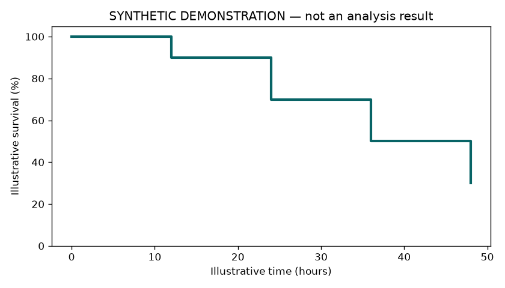

# Synthetic experiment report

This example demonstrates **formatted reports**, linked data and an interactive figure viewer. No animals or real experimental measurements are represented.

## Conditions

| Group | Illustrative count | Status |
| --- | ---: | --- |
| Synthetic control | 10 | Demonstration |
| Synthetic treatment | 10 | Demonstration |

## Figure



[Download synthetic counts](../assets/synthetic_counts.csv).
[Reference report](reference/overview.md).

## Reproduction

```sh
python examples/research_dashboard/build.py
```

[Raw analysis object](private_raw.pkl) is intentionally absent, to demonstrate a local-archive label.
